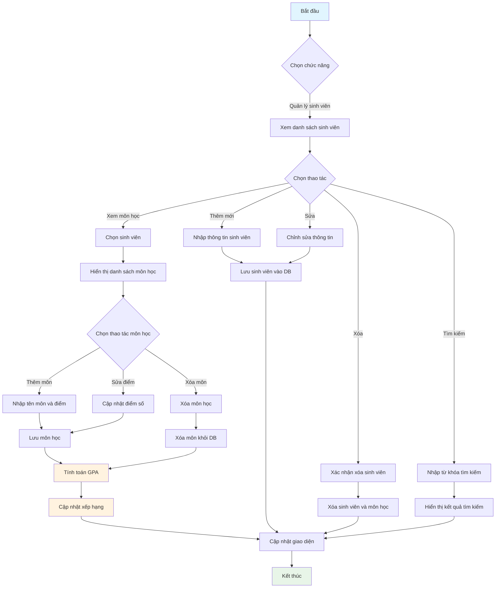
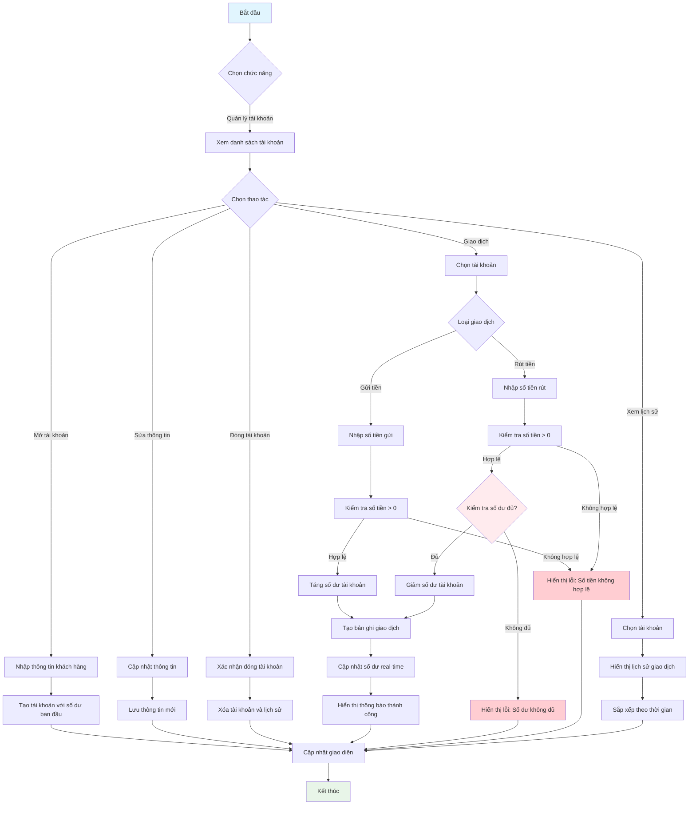
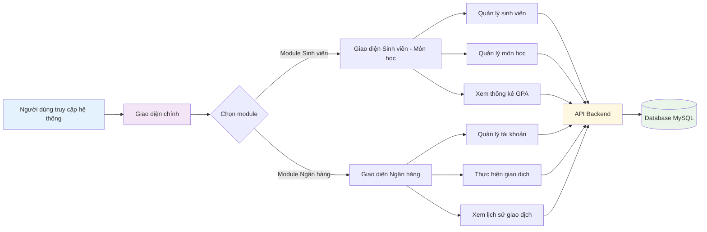
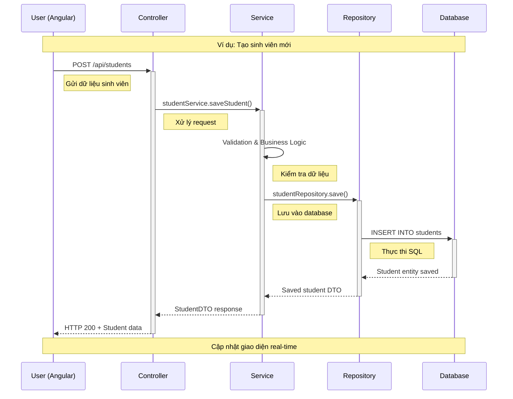
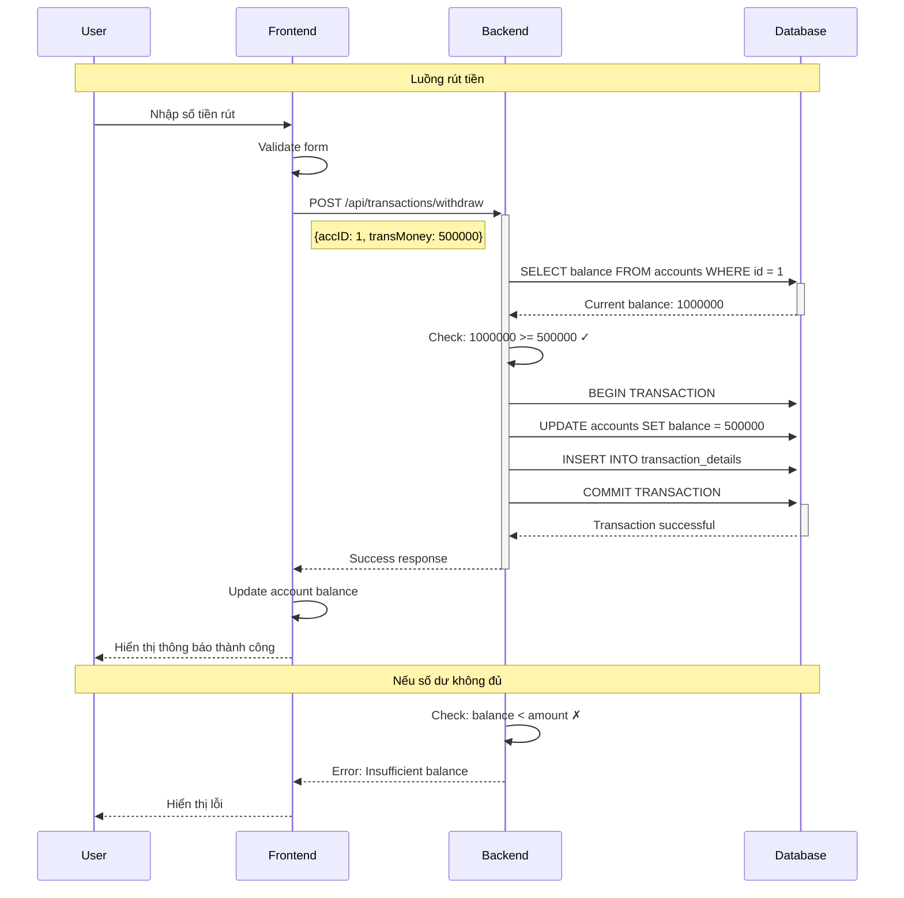
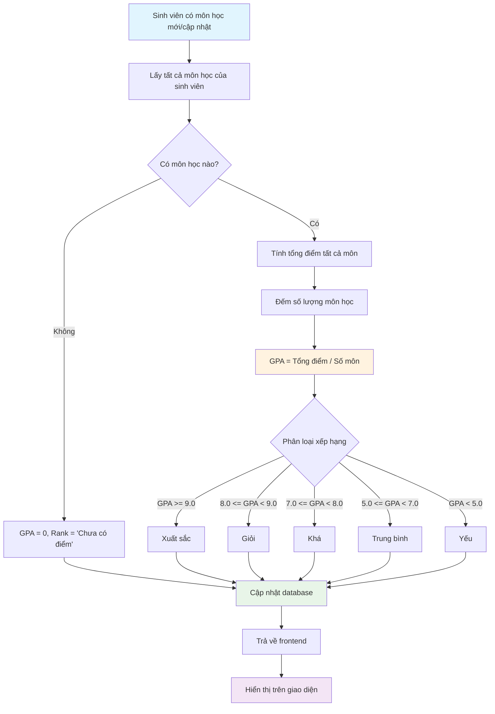
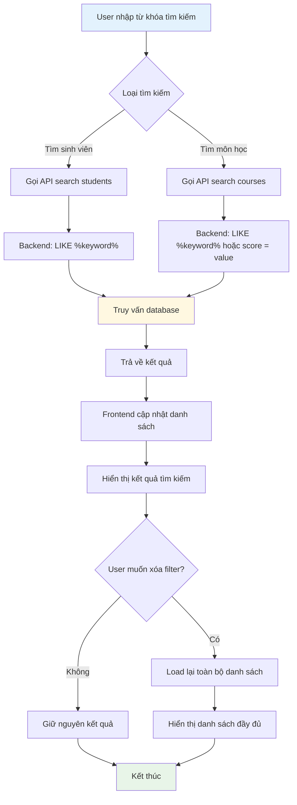

# 📊 Business Flow - Luồng Nghiệp Vụ Hệ Thống

## 🎯 Tổng Quan Hệ Thống

Hệ thống **Quản lý Sinh viên - Môn học và Ngân hàng** được thiết kế để phục vụ 2 nghiệp vụ chính:

1. **Module Quản lý Sinh viên - Môn học**: Quản lý thông tin sinh viên, môn học, điểm số và xếp hạng học tập
2. **Module Quản lý Ngân hàng**: Quản lý tài khoản khách hàng và các giao dịch ngân hàng

## 🏫 Module 1: Quản Lý Sinh Viên - Môn Học

### 📋 Quy Trình Nghiệp Vụ

#### 1. Quản Lý Sinh Viên

- **Thêm sinh viên mới**: Nhập thông tin cá nhân (tên, địa chỉ, số điện thoại, ngày sinh)
- **Cập nhật thông tin**: Chỉnh sửa thông tin sinh viên đã có
- **Xóa sinh viên**: Xóa sinh viên và tất cả môn học liên quan
- **Tìm kiếm**: Tìm kiếm sinh viên theo tên

#### 2. Quản Lý Môn Học

- **Thêm môn học**: Gán môn học cho sinh viên với điểm số (thang điểm 0-10)
- **Cập nhật điểm**: Chỉnh sửa điểm số môn học
- **Xóa môn học**: Xóa môn học khỏi danh sách của sinh viên

#### 3. Tính Toán Học Tập

- **Tự động tính GPA**: Tổng điểm / Số môn học
- **Xếp hạng học tập**:
  - Xuất sắc: GPA ≥ 9.0
  - Giỏi: 8.0 ≤ GPA < 9.0
  - Khá: 7.0 ≤ GPA < 8.0
  - Trung bình: 5.0 ≤ GPA < 7.0
  - Yếu: GPA < 5.0

### 🔄 Sơ Đồ Luồng Sinh Viên - Môn Học

## 🏦 Module 2: Quản Lý Ngân Hàng

### 📋 Quy Trình Nghiệp Vụ

#### 1. Quản Lý Tài Khoản

- **Mở tài khoản mới**: Tạo tài khoản với thông tin khách hàng và số dư ban đầu
- **Cập nhật thông tin**: Chỉnh sửa thông tin cá nhân (không thay đổi số dư)
- **Xóa tài khoản**: Xóa tài khoản và lịch sử giao dịch

#### 2. Xử Lý Giao Dịch

- **Gửi tiền (Deposit)**: Tăng số dư tài khoản
- **Rút tiền (Withdraw)**: Giảm số dư (kiểm tra số dư đủ)
- **Ghi nhận giao dịch**: Lưu lịch sử với timestamp

#### 3. Kiểm Soát Nghiệp Vụ

- **Kiểm tra số dư**: Đảm bảo đủ tiền khi rút
- **Validation**: Kiểm tra số tiền > 0
- **Cập nhật real-time**: Số dư được cập nhật ngay lập tức

### 🔄 Sơ Đồ Luồng Ngân Hàng

## 🔄 Luồng Tương Tác Hệ Thống Tổng Thể

### 🎛️ Giao Diện Người Dùng

## 🏗️ Kiến Trúc Hệ Thống

### 📡 Luồng Dữ Liệu API

### 🔄 Luồng Giao Dịch Ngân Hàng

## 📊 Quy Trình Tính Toán GPA

## 🔍 Luồng Tìm Kiếm và Lọc Dữ Liệu

